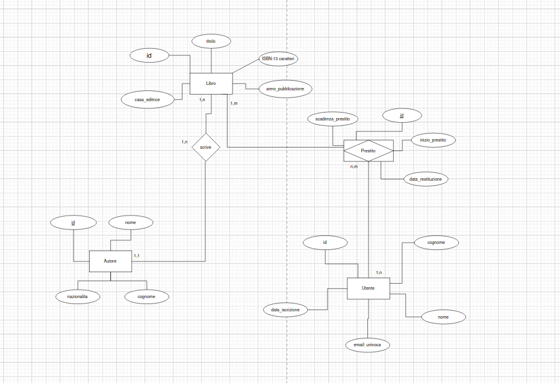

Ecco una traccia classica e realistica in stile esame accademico o prova tecnica. Questo scenario introduce le relazioni fondamentali del mondo relazionale ($1:N$ e $N:M$), la gestione delle quantità (magazzino) e lo storico delle operazioni (i prestiti), che sono i punti chiave su cui i professori amano valutare gli studenti.

---

## Traccia d'Esame: Sistema Gestione Biblioteca ("LibrERIA")

### Contesto del Problema

Si richiede la progettazione e la realizzazione del backend di un sistema informativo per la gestione di una biblioteca comunale. Il sistema deve permettere la catalogazione dei libri, la gestione degli utenti iscritti e il tracciamento dei prestiti dei volumi.

### Requisiti Funzionali (Entità e Relazioni)

1. **I Libri e gli Autori ($1:N$):**
* Di ogni **Libro** è necessario memorizzare: un codice identificativo univoco (ID), il titolo, il codice ISBN (13 caratteri), l'anno di pubblicazione e la casa editrice.
* Un libro è scritto da un **Autore**. Di ogni autore si vogliono tracciare: ID, nome, cognome, data di nascita e nazionalità.
* *Vincolo:* Ai fini dell'esame, si assuma che un libro abbia *un solo* autore principale, mentre un autore può aver scritto più libri.

2. **I Generi Letterari ($N:M$):**
* Ogni libro può appartenere a uno o più **Generi Letterari** (es. *Romanzo*, *Fantascienza*, *Giallo*, *Storico*). Un genere è identificato da un ID e da un nome univoco.
* Un genere può essere associato a molti libri.

3. **Gli Utenti:**
* La biblioteca gestisce gli **Utenti** iscritti al servizio di prestito. Di ciascuno si memorizzano: ID, nome, cognome, codice fiscale (univoco), email e data di iscrizione.

4. **La Gestione dei Prestiti (Entità Associativa con attributi):**
* Un utente può richiedere in prestito uno o più libri. Un libro può essere preso in prestito nel tempo da molti utenti.
* Per ogni **Prestito** occorre registrare: la data di inizio prestito, la data di scadenza (fissata a 30 giorni dopo) e la data di effettiva restituzione (che inizialmente sarà `null`).
* *Regola di Business:* Non è possibile cancellare lo storico dei prestiti; quando un libro viene restituito, si aggiorna semplicemente la data di restituzione.

---

## Schema Concettuale (Suggerimento per i Bean JPA)

Per superare l'esame a pieni voti, la struttura delle tabelle deve riflettere queste relazioni. Ecco come si traduce logicamente questa traccia:

* **`Autore`**
* **`Libro`** $\rightarrow$ Contiene una chiave esterna `autore_id` (ManyToOne).
* **`Genere`**
* **Tabella di Join `libro_genere**` $\rightarrow$ Creata automaticamente da JPA (ManyToMany) per legare Libri e Generi.
* **`Utente`**
* **`Prestito`** $\rightarrow$ Questa è la tabella centrale dell'esame. Contiene una chiave esterna verso `Utente` (ManyToOne), una verso `Libro` (ManyToOne) e i campi per le date.

---

### Obiettivi dell'Esercizio

Se vuoi esercitarti a fondo, prova a:

1. Creare le Entity JPA con le corrette annotazioni (`@ManyToOne`, `@ManyToMany`, ecc.).
2. Impostare la proprietà `spring.jpa.hibernate.ddl-auto=update` per vedere come Hibernate genera questo schema su H2.
3. Implementare un metodo nel Service per rispondere a una domanda tipica da esame: *"Trova tutti i libri attualmente in prestito che non sono ancora stati restituiti e hanno superato la data di scadenza"*.

### Struttura DB Libreria

Per l'implementazione del DB si è usato H2 un DB di sviluppo leggero e facile da gestire. Tutti i dati vengono immagazzinati in un file all'interno della cartella ./data

La scrittura e la definizione delle tabelle viene gestita tramite spring jpa, un ORM di spring boot che si occupa di gestire la connessione con il db e di interagire con esso.